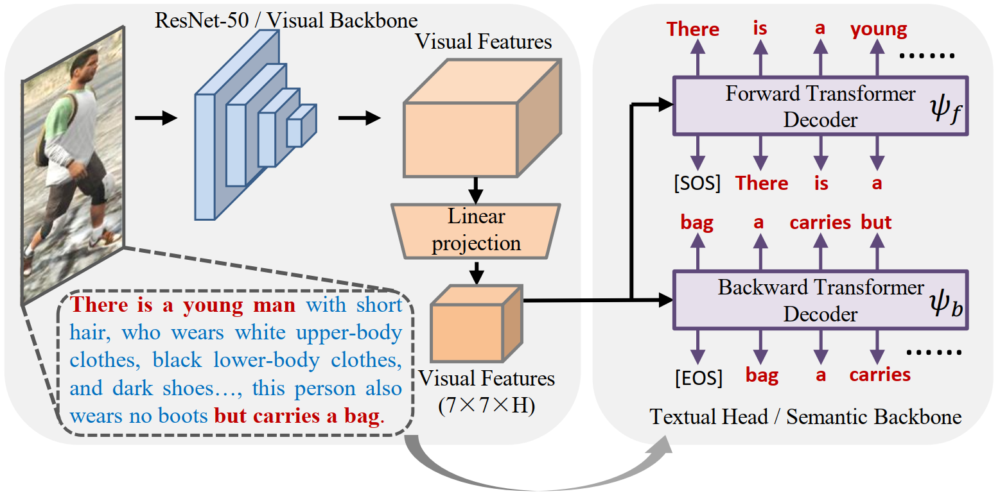

Rethinking Person Re-Identification via Semantic-Based Pretraining
================================================================

<h4>
Suncheng Xiang
</br>
<span style="font-size: 14pt; color: #555555">
Shanghai Jiao Tong University
</span>
</h4>
<hr>

**arXiv paper** [arxiv.org/pdf/2110.05074][1]

**Model Zoo, Usage Instructions and API docs:** [VTBR](https://github.com/JeremyXSC/VTBR)

VTBR uses transformers to learn visual representations from textual annotations, the overview of our framework is illustrated in Figure~\ref{fig1}. Particularly, we jointly train a CNN-based network and transformer-based network from scratch using image caption pairs for the task of image captioning. Then, we transfer the learned residual network to downstream Re-ID tasks. In general, our method seeks a common vision-language feature space with discriminative learning constraints for better practical deployment.
VTBR matches or outperforms models which use ImageNet for pretraining -- 
both supervised or unsupervised -- despite using up to 1.4x fewer images.




Get the pretrained ResNet-50 visual backbone from our best performing VirTex
model in one line *without any installation*!


**Model Preparation**
```python
import torch

# That's it, this one line only requires PyTorch.
model = torch.hub.load("kdexd/virtex", "resnet50", pretrained=True)
```

The pretrained models in our model zoo have changed from [`v1.0`](https://github.com/kdexd/virtex/releases/tag/v1.0) onwards.


**Training the base model**
```python
python scripts/pretrain_virtex.py \
    --config configs/_base_bicaptioning_R_50_L1_H1024.yaml \
    --num-gpus-per-machine 8 \
    --cpu-workers 4 \
    --serialization-dir /tmp/VIRTEX_R_50_L1_H1024
    # Default: --checkpoint-every 2000 --log-every 20
```


### Acknowledgments
This work was supported by the National Natural Science Foundation of China under Project(Grant No.62301315) and Startup Fund for Young Faculty at SJTU (SFYF at SJTU) under Grant No.23X010501967.
If you have further questions and suggestions, please feel free to contact us (xiangsuncheng17@sjtu.edu.cn).

If you find this code useful in your research, please consider citing:
```
@article{xiang2021rethinking,
  title={Rethinking Person Re-Identification via Semantic-Based Pretraining},
  author={Xiang, Suncheng and Gao, Jingsheng and Zhang, Zirui and Guan, Mengyuan and Yan, Binjie and Liu, Ting and Qian, Dahong and Fu, Yuzhuo},
  journal={arXiv preprint arXiv:2110.05074},
  year={2021}
}
```


